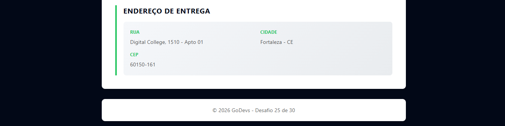

# 📦 Resumo de Pedido com Destructuring

> Um projeto educacional desenvolvido na plataforma GoDevs que demonstra o uso de **destructuring** em JavaScript para manipulação de dados complexos e exibição de resumo de pedidos.

---

## 📋 Descrição

Este projeto é uma aplicação web simples que simula um sistema de checkout, exibindo um resumo completo do pedido do cliente. O projeto utiliza **destructuring de objetos** e **destructuring de arrays** em JavaScript para extrair dados específicos de um objeto de pedido complexo.

A aplicação demonstra conceitos fundamentais de ES6+ como:
- ✅ Destructuring de objetos
- ✅ Destructuring de arrays
- ✅ DOM manipulation
- ✅ Formatação de dados

---

## 🎯 Requisitos Técnicos

O projeto implementa os seguintes requisitos:

### 1. Objeto Complexo de Pedido
- ✅ Cliente (nome, email)
- ✅ Array de itens com múltiplos produtos
- ✅ Endereço de entrega

### 2. Destructuring de Objetos
```javascript
// Extrai nome e email do cliente
const { nome, email } = pedido.cliente;

// Extrai dados do endereço
const { rua, numero, complemento, cidade, estado, cep } = pedido.endereco;
```

### 3. Destructuring de Arrays
```javascript
// Captura o primeiro e o último item do array
const [primeiroItem, , ultimoItem] = pedido.itens;
```

### 4. Exibição Formatada
- Resumo visual do pedido na página
- Informações organizadas por seções
- Formatação de valores em moeda brasileira

---

## 🛠️ Tecnologias Utilizadas


---

## 📁 Estrutura do Projeto

```
resumo-de-pedido-com-destructuring/
│
├── index.html           # Arquivo HTML principal
├── css/
│   └── style.css       # Estilos da aplicação
├── js/
│   └── script.js       # Lógica JavaScript com destructuring
├── assets/
│   ├── preview-cliente-itens.png
│   └── preview-endereco.png
└── README.md           # Este arquivo
```

---

## 🎨 Preview do Projeto

### Seção de Cliente e Itens do Pedido


### Seção de Endereço de Entrega


---

## 🚀 Como Usar

### 1. Clonar o Repositório
```bash
git clone https://github.com/Guielihan/resumo-de-pedido-com-destructuring.git
cd resumo-de-pedido-com-destructuring
```

### 2. Abrir o Projeto
Abra o arquivo `index.html` diretamente no seu navegador:
- Clique duas vezes em `index.html`, ou
- Arraste o arquivo para o navegador

### 3. Visualizar o Console
Pressione `F12` e vá para a aba **Console** para ver os dados extraídos via destructuring.

---

## 💡 Exemplos de Destructuring Utilizados

### Destructuring de Objeto
```javascript
const pedido = {
    cliente: {
        nome: "Guilherme Queiroz",
        email: "guielihan@outlook.com"
    }
};

const { nome, email } = pedido.cliente;
console.log(nome);   // "Guilherme Queiroz"
console.log(email);  // "guielihan@outlook.com"
```

### Destructuring de Array
```javascript
const itens = ["Notebook", "Teclado", "Webcam"];

const [primeiro, , ultimo] = itens;
console.log(primeiro);  // "Notebook"
console.log(ultimo);    // "Webcam"
```

---

## 📚 Aprendizados Principais

- Utilização de **destructuring** para código mais limpo e legível
- Manipulação de objetos complexos em JavaScript
- Formatação de dados para exibição ao usuário
- Estruturação de aplicações web simples
- Uso de **Intl.NumberFormat** para formatação de moeda

---

## 👨‍💻 Desenvolvedor

**Guilherme Queiroz (Guielihan)**

<div style="display: flex; gap: 10px; flex-wrap: wrap;">
  <a href="https://discord.com/users/1297971679737413632">
    
  </a>
  <a href="https://www.instagram.com/devguielihan/">
    
  </a>
  <a href="mailto:devguielihan@gmail.com">
    
  </a>
</div>

---

## 🎓 Agradecimentos e Referências

<div style="display: flex; gap: 10px; flex-wrap: wrap;">
  <a href="https://github.com/in100tiva">
    
  </a>
  <a href="https://godevs.in100tiva.com/">
    
  </a>
</div>

---

<p align="center">
  Feito com 💙 por Guielihan
</p>
